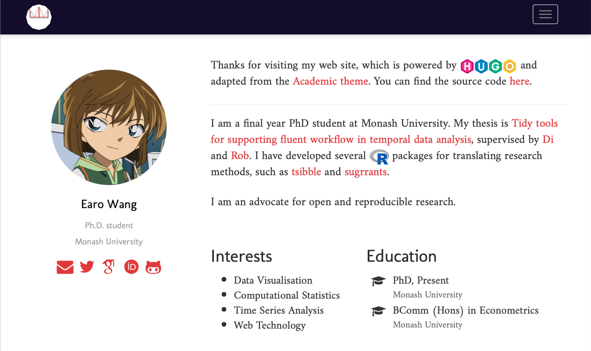
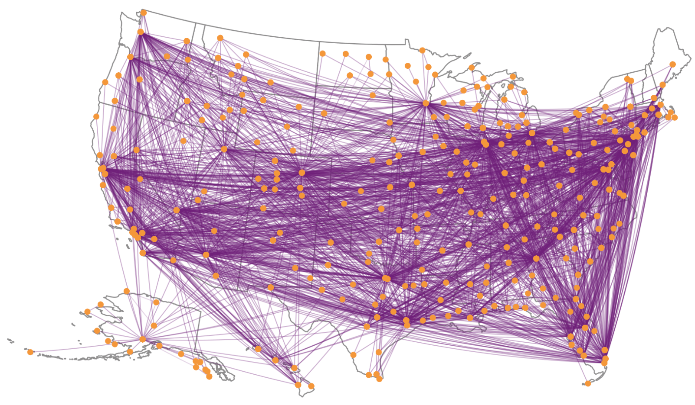
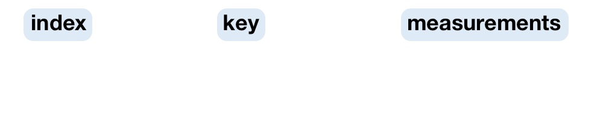
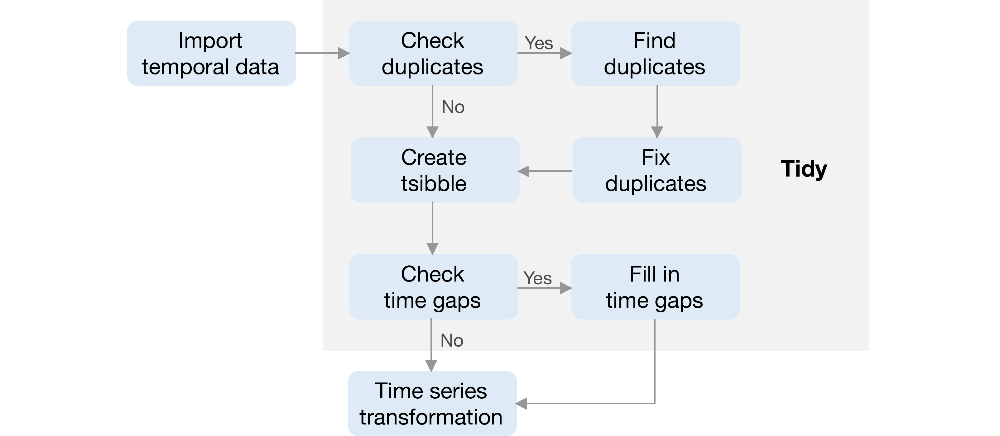
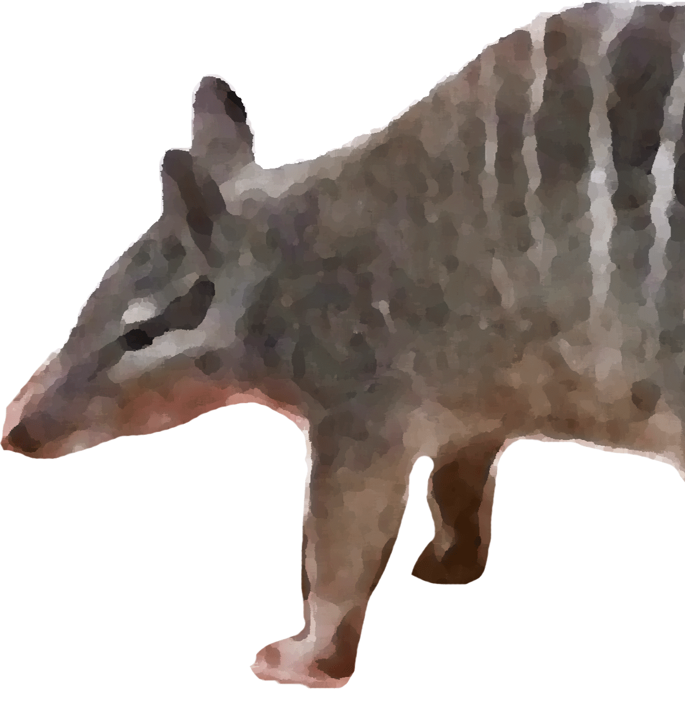

```{r initial, echo = FALSE, cache = FALSE, results = 'hide'}
library(knitr)
options(htmltools.dir.version = FALSE, tibble.width = 60, tibble.print_min = 6)
opts_chunk$set(
  echo = FALSE, warning = FALSE, message = FALSE, comment = "#>",
  fig.path = 'figure/', cache.path = 'cache/', fig.align = 'center', 
  fig.width = 12, fig.show = 'hold', fig.height = 8.5, 
  cache = FALSE, external = TRUE, dev = 'svglite'
)
hook_error = knit_hooks$get('error')
knit_hooks$set(error = function(x, options) {
  y <- strsplit(x, "\n")[[1]]
  z <- paste(strwrap(y, width = 40), collapse = "\n")
  hook_error(z, options)
})
read_chunk('R/theme.R')
read_chunk('R/web.R')
read_chunk('R/flights.R')
```

```{r theme-remark}
```

class: inverse middle

# What is (temporal) data analysis?

---

class: middle

> Data analysis is a process of .orange[inspecting], .orange[cleansing], .orange[transforming], and .orange[modeling] data with the goal of discovering useful information, informing conclusions, and supporting decision-making. <br>
--- [Wikipedia](https://en.wikipedia.org/wiki/Data_analysis)

---

class: middle

> .orange[Temporal data analysis] is a process of inspecting, cleansing, transforming, and modeling .orange[time-indexed] data with the goal of discovering useful information, informing conclusions, and supporting decision-making .orange[related to time]. <br>
--- [EaroWiki](https://earo.me)

---

class: inverse middle

# What are .barcode[messy] tools?

---

class: middle

background-image: url(img/model-forecast.png)
background-size: 75%

.pull-left[
]
.pull-right[
.rotate-45[
.alert[
.center[
**2018** <br>
**ETC3550: Applied forecasting**
]
]
]
]

???

* verbose but distracting
* focus on code but not the idea

---

class: middle

background-image: url(img/model-forecast.png)
background-size: 75%

.pull-left[
]
.pull-right[
.card[
`r emo::ji("thinking")` Should all forecasting students be programmers?
]
]

---

class: inverse middle

# What are ~~messy~~ tidy tools?

---

class: middle

background-image: url(img/model-fable.png)
background-size: 75%

.pull-left[
]
.pull-right[
.rotate-45[
.alert[
.center[
**2019** <br>
**ETC3550: Applied forecasting**
]
]
]
]

???

* focus on the idea not the code
* focus on the data and expressiveness

---

class: middle

1. Tidy tools are .orange[accessible].
2. Tidy tools are .orange[expressive].
3. Tidy tools are .orange[pipeable].

```r
marathon %>% 
  model(
    linear = TSLM(Minutes ~ trend()),
    exponential = TSLM(log(Minutes) ~ trend()),
    piecewise = TSLM(Minutes ~ trend(knots = c(1940, 1980)))
  ) %>% 
  forecast(h = 10)
```

---

class: inverse middle

# What is fluent workflow?

---

.left-column[
.center[
## Welcome to

]
]
.right-column[
<br>
<br>

]

--

### .center[Behind fluent workflow is tidy data.]

---

.left-column[
.center[
## Welcome to <br> .red[time series analysis]
]
]
.right-column[
<br>
<br>

]

### .center[WAT!`r emo::ji("scream")`]

---

.left-column[
## .center[WAT!`r emo::ji("scream")`]
]
.right-column[
```r
# Put them into a big matrix
ltraffics <- list(as.bf.cpu, as.bf.busy, as.bf.memory, as.bf.page,
                  as.gq.cpu, as.gq.busy, as.gq.memory, as.gq.page,
                  as.ir.cpu, as.ir.busy, as.ir.memory, as.ir.page,
                  ...
                  hs.gq.cpu, hs.gq.busy, hs.gq.memory, hs.gq.page,
                  hs.ir.cpu, hs.ir.busy, hs.ir.memory, hs.ir.page,
                  hs.ne.cpu, hs.ne.busy, hs.ne.memory, hs.ne.page,
                  hs.sg.cpu, hs.sg.busy, hs.sg.memory, hs.sg.page)
indcols <- sapply(ltraffics, ncol)
cs <- cumsum(c(1, indcols))
totalcols <- sum(indcols)
traffics <- matrix(, nrow = 719, ncol = totalcols)
for (i in 1L:length(ltraffics)) {
  idx <- cs[i]:(cs[i + 1] - 1L)
  traffics[, idx] <- as.matrix(ltraffics[[i]][1:719, ])
}
```
]

---

background-image: url(img/tsibble-model.png)
background-size: 70%
background-position: 91% 38%

.left-column[
## .center[Welcome <br> to <br> the tidyver.red[ts]]
]
.right-column[
.animated.slower.rollIn[
.pipeline[]
]
]

### .bottom[.center[Tsibble defines tidy data in temporal context.]]

---

class: inverse middle

# Data analysis <br> doesn't make sense <br> without data.

---

class: center middle

## Parallel data stories

.pull-left[


### Web traffic at [earo.me](http://earo.me)
]
.pull-right[


### Airline traffic in the US
]

---

.pull-left[
### Web traffic

```{r load-web}
```
]
.pull-right[
### Airline

```{r load-flights}
```
]

---

class: inverse middle

# .blue[1.] Tsibble is <br> data representation <br> for tidy temporal data.

<hr>



---

.top[]

## Contextual semantics

.pull-left[
### .brown[1.] Index

Time indices provide a contextual basis for temporal data.

* acknowledge the diversity of time representations
* respect time zones
* allow regular/irregular interval
]
.pull-right[
### .brown[2.] Key

Key identifies observational units recorded over time.

* comprise empty, one or more variables
* known a priori by analysts
* determine unique time indices
]

---

class: middle

## Creating a tsibble

.pull-left[
```{r web-tsibble, echo = TRUE}
```

```{r highlight.output = 1}
web_ts
```

]

--

.pull-right[
```{r try-tsibble, echo = TRUE, error = TRUE}
```
### .red[Oops!]
]

---

## <i class="fas fa-search"></i> duplicates and <i class="fas fa-wrench"></i> them

```{r find-duplicate, echo = TRUE, eval = FALSE}
```

```{r highlight.output = c(4, 8)}
flights %>% 
  duplicates(key = id(flight_num), index = sched_dep_datetime) %>% 
  print(width = 100)
```

---

```{r find-duplicate-lgl}
```

```{r tsibble, echo = TRUE}
```

```{r highlight.output = 1:2}
print(flights_ts, width = 70)
```

---



---

.top[]

## In harmony with grammar of graphics

```{r web-ggplot, fig.height = 2.5, echo = TRUE}
```

---

.top[]

## In harmony with grammar of graphics

```{r web-geom, fig.height = 2.5, echo = TRUE}
```

---

class: inverse middle

# .blue[2.] Tsibble is <br> a domain specific language in <i class="fab fa-r-project"></i> <br> for wrangling temporal data.

<hr>

### Good fluent APIs take a while to build.

---

.pull-left[
**.brown[1.] Vector functions**
* `yearmonth()`/`yearquarter()`
* `time_in()`
* `difference()`

**.brown[3.] Window family**
* `slide()`/`future_slide()`
* `tile()`/`future_tile()`
* `stretch()`/`future_stretch()`
]
.pull-right[
**.brown[2.] Table verbs**
* `scan_gaps()`/`fill_gaps()`
* `index_by()`/`group_by_key()`
* `filter_index()`

**.brown[4.] Extend tsibble**
* `index_valid()`
* `pull_interval()`
* `new_tsibble()`
]

---

class: center

.left-column[
## Scroll down <br> for <br> the full vocabulary
]
.right-column[
<br>

<iframe src="https://tsibble.tidyverts.org/reference/index.html" frameborder="0" height="400" width="750">
</iframe>

### [tsibble.tidyverts.org](https://tsibble.tidyverts.org)
]

---

class: center middle


## standing on the shoulders of giants

.animated.fadeInRight.slow[
.orange[
```{r tidyverse, comment = ""}
tidyverse::tidyverse_logo()
```
]
]

---

.pull-left[

```{r web-tsibble-select, echo = TRUE, message = TRUE}
```
]
.pull-right[

```{r web-dplyr-select, echo = TRUE}
```
]

---

.pull-left[

```{r web-tsibble-summarise, echo = TRUE}
```
]
.pull-right[

```{r web-dplyr-summarise, echo = TRUE}
```
]

---

.top[]

## Compose a prose

.pull-left[
```{r web-year, echo = TRUE, results = "hide"}
```
```{r}
web_year
```
]
.pull-right[
```{r web-year-bar, fig.height = 8}
```
]

---

.top[]

```{r sel-flights, echo = TRUE}
```
.pull-left[
```{r}
sel_delay
```
]
.pull-right[
```{r sel-flights-plot, fig.height = 7}
```
]

---

class: inverse middle

# .blue[3.] Tsibble rolls with <br> functional programming.

<hr>

### FP focuses on expressions instead of for-loop statements.

---

class: center middle


## The future is around the corner.

---

class: inverse middle

# `r emo::ji("star2")` Impact

---

class: middle

.pull-left[
### sugrrants <a class="github-button" href="https://github.com/earowang/sugrrants" data-size="large" data-show-count="true" aria-label="Star earowang/sugrrants on GitHub">Star</a>
`r emo::ji("1st_place_medal")` 2018 Best student paper award from ASA Section on Statistical Graphics

<hr>

### tsibble <a class="github-button" href="https://github.com/tidyverts/tsibble" data-size="large" data-show-count="true" aria-label="Star tidyverts/tsibble on GitHub">Star</a>
`r emo::ji("trophy")` 2019 John Chambers Statistical Software Award from ASA Section on Statistical Computing
]
.pull-right[
Total downloads, as of `r Sys.Date() - 1`
```{r software-impact, fig.height = 10}
library(cranlogs)
pkgs_dl <- cran_downloads(c("sugrrants", "tsibble"), from = "2017-07-28")
pkgs_dl %>% 
  group_by(package) %>% 
  summarise(count = sum(count)) %>% 
  ggplot(aes(x = package, y = count)) +
  geom_col(aes(fill = package)) +
  geom_text(aes(label = count), vjust = -0.5, size = 10) +
  geom_text(aes(y = 0, label = package), hjust = -0.1, vjust = -2, size = 15, angle = 45) +
  guides(fill = "none")
```
]

---

class: inverse middle

# `r emo::ji("open_book")` Research compendium

<hr>

### A form of publication contains all data and software for better reproducibility, besides the text and figures.
**Marwick et al. (2018) [peerj.com/preprints/3192](https://peerj.com/preprints/3192/)**

---

class: middle

```{r}
library(data.tree)
root <- Node$new(".")
desc <- root$AddChild("DESCRIPION # Lists of packages used for thesis")
scripts <- root$AddChild("scripts/   # R code for analysis")
rmd <- root$AddChild("Rmd/       # R Markdown for thesis document")
data <- root$AddChild("data/      # Cleaned data used for thesis document")
data_raw <- root$AddChild("data-raw/  # Raw data and scripts to clean data")
docker <- root$AddChild("Dockerfile")
others <- root$AddChild("...")
root
```


### .center[<i class="fab fa-github"></i> [earowang/thesis](https://github.com/earowang/thesis)]

## .center[Persistent reproducibility]

---

class: center middle

<iframe src="https://thesis.earo.me/preface.html" frameborder="0" height="400" width="850">
</iframe>

### <i class="fas fa-link"></i> [thesis.earo.me](https://thesis.earo.me)

## Open access

---

class: inverse

.left-column[
.animated.pulse.infinite[
# .red[.center[`r emo::ji("heart")`]]
]
]
.right-column[
.portrait[

Di
]
.portrait[

Rob
]
<br>
.portrait[

Heike
]
.portrait[

Mitch
]
.portrait[

Stuart
]
.portrait[

David
]
.portrait[

Roger
]
.portrait[

NUMBATs
]
.portrait[

<i class="fab fa-r-project"></i> community
]
]

---

class: inverse middle center

# .animated.zoomOut.slower.delay-2s[.large[FIN]]
