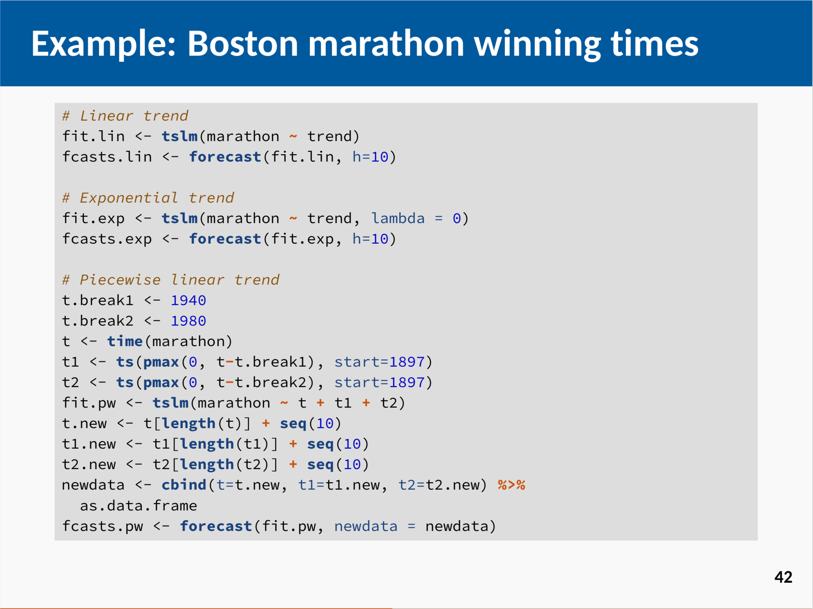
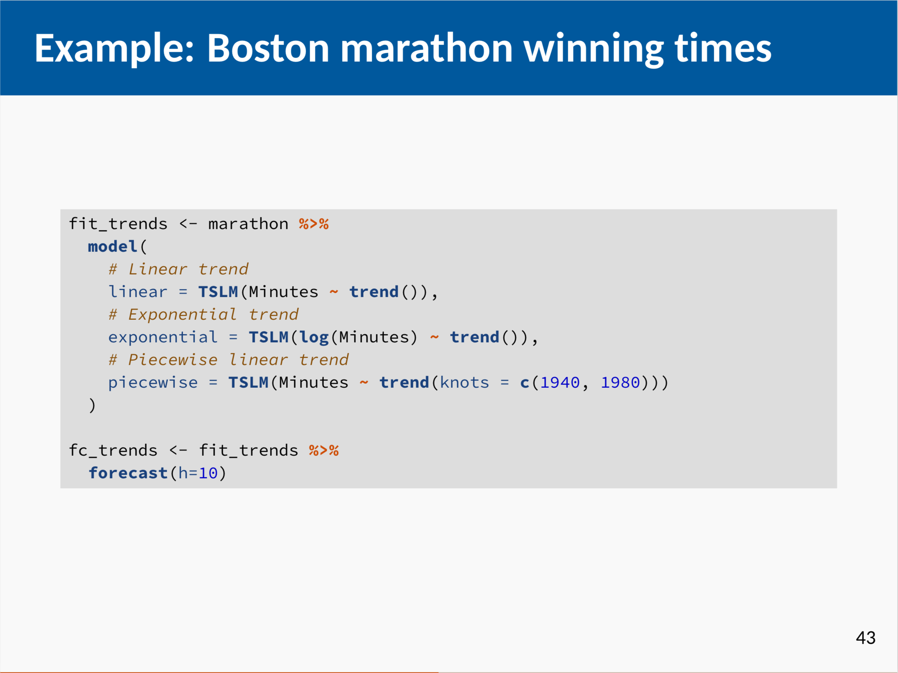

```{r initial, echo = FALSE, cache = FALSE, results = 'hide'}
library(knitr)
options(htmltools.dir.version = FALSE, tibble.width = 60, tibble.print_min = 6)
opts_chunk$set(
  echo = FALSE, warning = FALSE, message = FALSE, comment = "#>",
  fig.path = 'figure/', cache.path = 'cache/', fig.align = 'center', 
  fig.width = 12, fig.show = 'hold', fig.height = 8.5, 
  cache = TRUE, external = TRUE, dev = 'png', dpi = 300
)
read_chunk('R/theme.R')
```

```{r theme-remark}
```

class: inverse middle

# What is (temporal) data analysis?

---

class: middle

> Data analysis is a process of .orange[inspecting], .orange[cleansing], .orange[transforming], and .orange[modeling] data with the goal of discovering useful information, informing conclusions, and supporting decision-making. ([Wikipedia](https://en.wikipedia.org/wiki/Data_analysis))

---

class: inverse middle

# What are .barcode[messy] tools?

---

class: middle

background-image: url(img/model-forecast.png)
background-size: 75%

.pull-left[
]
.pull-right[
.rotate-45[
.alert[
.center[
**2018** <br>
**ETC3550: Applied forecasting**
]
]
]
]

???

* verbose but distracting
* focus on code but not the idea

---

class: middle

background-image: url(img/model-forecast.png)
background-size: 75%

.pull-left[
]
.pull-right[
.card[
`r emo::ji("thinking")` Should all forecasting students be programmers?
]
]

---

class: inverse middle

# What are ~~messy~~ tidy tools?

---

class: middle

background-image: url(img/model-fable.png)
background-size: 75%

.pull-left[
]
.pull-right[
.rotate-45[
.alert[
.center[
**2019** <br>
**ETC3550: Applied forecasting**
]
]
]
]

???

* focus on the idea not the code
* focus on the data and expressiveness

---

## Tidy tools are

1.
2.
3.

---

.pull-left[
### 2018

]
.pull-right[
### 2019

]

--

## .center[Behind tidy tools is tidy temporal data.]

---

class: center middle


## The future of temporal data

---

class: center middle


## The future is just around the corner.

---

## Tsibble is

1. a data representation for tidy temporal data
2. a domain specific language in R for wrangling temporal data

---

class: inverse middle

# What is fluent workflow?
