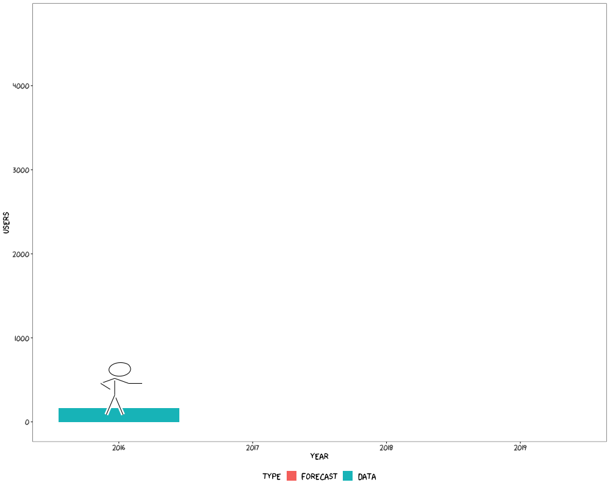

```{r initial, echo = FALSE, cache = FALSE, results = 'hide'}
library(knitr)
options(htmltools.dir.version = FALSE, tibble.width = 60, tibble.print_min = 6)
opts_chunk$set(
  echo = FALSE, warning = FALSE, message = FALSE, comment = "#>",
  fig.path = 'figure/', cache.path = 'cache/', fig.align = 'center', 
  fig.width = 12, fig.show = 'hold', fig.height = 8.5, 
  cache = TRUE, external = TRUE, dev = 'svglite'
)
hook_error = knit_hooks$get('error')
knit_hooks$set(error = function(x, options) {
  y <- strsplit(x, "\n")[[1]]
  z <- paste(strwrap(y, width = 40), collapse = "\n")
  hook_error(z, options)
})
read_chunk('R/theme.R')
read_chunk('R/web.R')
read_chunk('R/flights.R')
```

```{r theme-remark}
```

class: inverse middle

# What is (temporal) data analysis?

???

What is data analysis? and what is temporal data analysis.

---

class: middle

> Data analysis is a process of .orange[inspecting], .orange[cleansing], .orange[transforming], and .orange[modeling] data with the goal of discovering useful information, informing conclusions, and supporting decision-making. <br>
--- [Wikipedia](https://en.wikipedia.org/wiki/Data_analysis)

???

There is a great amount of variation in defining what is a data analysis. According to Wikipedia, data analysis is a process: inspecting, cleansing, transforming, and modelling. And out of this process, we'll learn some knowledge and insights from the data, and make some decisions.

---

class: middle

> .orange[Temporal data analysis] is a process of inspecting, cleansing, transforming, and modeling .orange[time-indexed] data with the goal of discovering useful information, informing conclusions, and supporting decision-making .orange[related to time]. <br>
--- [EaroWiki](https://earo.me)

???

How about temporal data analysis? We still go through the same process, but the data dealt with is time-indexed data. The decisions we're going to make are somehow related to time.

But in order to conduct this process and analyse the data, we need tools. There are many tools out there. We have to carefully choose the good ones to lubricate this process as smoothly as possible. This set of tools, we call them "tidy tools".

---

class: inverse middle

# What are .barcode[messy] tools?

???

Before introducing you tidy tools, I'd like to show you an example of what messy tools are.

---

class: middle

background-image: url(img/model-forecast.png)
background-size: 75%

.pull-left[
]
.pull-right[
.rotate-45[
.alert[
.center[
**2018** <br>
**ETC3550: Applied forecasting**
]
]
]
]

???

This is a slide that I took from last year's Applied forecasting unit taught by Rob. I'm going say this is the messy tools' example. (Sorry, Rob)

It's about fitting three regressions on one data set but with different time trends as regressors. The first two code blocks are straightforward: the first one is linear trend and then forecast 10 steps ahead; the second is exponential trend by taking a log transformation on the response variable but using `lambda = 0` and then forecast.

But the third one looks a bit horrified, many new functions have been introduced. The actual idea is simple, fitting a piecewise linear trend. Clearly this `tslm()` doesn't incorporate the piecewise case. So both the lecturer and the students get distracted from the modelling idea but have to understand how to implement the algorithm first. More importantly, this piece of code is very ad hoc. A few tweaks needed for a different data set, and there's possibility to invite mistakes while tweaking.

---

class: middle

background-image: url(img/model-forecast.png)
background-size: 75%

.pull-left[
]
.pull-right[
.card[
`r emo::ji("thinking")` Should all forecasting students be programmers?
]
]

???

This makes me wonder if students should become programmers first before they can become forecasters.

---

class: middle

background-image: url(img/model-forecast.png)
background-size: 75%

.pull-left[
]
.pull-right[
.card[
`r emo::ji("thinking")` Should all forecasting students be programmers?
]

.rotate-45[
.center[
## [NO!](https://speakerdeck.com/hadley/should-all-statistics-students-be-programmers)
]
]
]

???

Definitely not!

They do have to know how to program to do data analysis. But they don't have to be programmers. Particularly it's not the purpose of that unit.

Now I hope you get a sense of what are messy tools. In terms of sensation, messy tools are smelly.

---

class: inverse middle

# What are ~~messy~~ tidy tools?

???

Contrasting to messy tools, they are tidy tools.

---

class: middle

background-image: url(img/model-fable.png)
background-size: 75%

.pull-left[
]
.pull-right[
.rotate-45[
.alert[
.center[
**2019** <br>
**ETC3550: Applied forecasting**
]
]
]
]

???

This year, Rob is going to teach the same materials but use a different set of tools. You can see the code is clean and succinct.

Most importantly, it helps to communicate the modelling idea in a very clear way. We are going to model this data with three linear regressions. It also addresses the difference between piecewise and a linear trend is by adding knots. Once we're done with model fitting, we forecast them as a whole.

What has been abstracted away is computational implementations and put more emphasis on ideas and expressions. It makes teaching easier and more fun. The door for introducing mistakes is closed. This set of tools are "tidy tools". (Good job, Rob)

---

class: middle

1. **Tidy tools are .orange[accessible].**
2. **Tidy tools are .orange[expressive].**
3. **Tidy tools are .orange[pipeable].**

```r
marathon %>% 
  model(
*   linear = TSLM(Minutes ~ trend()),
*   exponential = TSLM(log(Minutes) ~ trend()),
*   piecewise = TSLM(Minutes ~ trend(knots = c(1940, 1980)))
  ) %>% 
  forecast(h = 10)
```

???

This is my conceptualisation about "tidy tools":

1. Tidy tools are accessible. It means anyone can run this bit of code, anywhere anytime, to produce identical results. There shouldn't be a paywall to prevent users from using it. The source code can be inspected by others as well.
2. Tidy tools are expressive. Tidy tools are code, and code is text. We can express our ideas in text and we can frame our data analysis problems through code. Code is documentation, documenting how we approach the problem. We can easily share plain text across different platforms and groups of people. This goes beyond what point and click software can do. Yes, it is R code. But I believe someone who never used R before, they should be able to quickly get what's happening here. This is the power of expressiveness.
3. Tidy tools are pipeable. Because the input format is consistent with the output format. We can chain these operations together to build a fluent pipeline and read more naturally. Modelling and then forecasting. It makes possible to have fluent workflow.

---

class: inverse middle

# What is fluent workflow?

---

.left-column[
.center[
## Welcome to

]
]
.right-column[
<br>
<br>

]

### .center[Behind fluent workflow is [tidy data](https://tidyr.tidyverse.org/articles/tidy-data.html).]

???

Data analysis is a process, particularly it's an iterative process.

The tidyverse is a collection of R packages to help with this process quick and tidy.

Why it's important? Before deploying the final model into the production stage, we need to repeat this process many many times. If this model doesn't work, we make some tweaks, and then fit another model. We want this iteration as rapid as possible.

In addition to tidy tools, what's underlying this fluent workflow is tidy data.

The "tidy" stage doesn't mean data cleaning, but refers to making the data in a right shape, a uniform shape that is shared by these three stages in this circle.

With the tidyverse, we have such a fluent pipeline to handle data analysis. But when you have time series data and want to do time series analysis ...

---

.left-column[
.center[
## Welcome to <br> .red[time series analysis]
]
]
.right-column[
<br>
<br>

]

### .center[WAT!`r emo::ji("scream")`]

???

This is what you experience. Lots of you in this department primarily focus on the statistical models. But I have been working on the rest of the process to support modelling.

Small data lives in csv files, big data stays in database. But most time, the form of the data at the "import" stage deviates a lot from the current time series objects that are designed for modelling. When doing transformation and visualisation, different data shapes are expected. We do not have a uniform shape for lubricating this process for time series. There's no formal guidance how to reshape the data for modelling purpose.

Screaming out "WAT" is the natural response to this workflow. Let me share my "WAT" moment.

---

.left-column[
## .center[WAT!`r emo::ji("scream")`]
]
.right-column[
```r
# Put them into a big matrix
ltraffics <- list(as.bf.cpu, as.bf.busy, as.bf.memory, as.bf.page,
                  as.gq.cpu, as.gq.busy, as.gq.memory, as.gq.page,
                  as.ir.cpu, as.ir.busy, as.ir.memory, as.ir.page,
                  ...
                  hs.gq.cpu, hs.gq.busy, hs.gq.memory, hs.gq.page,
                  hs.ir.cpu, hs.ir.busy, hs.ir.memory, hs.ir.page,
                  hs.ne.cpu, hs.ne.busy, hs.ne.memory, hs.ne.page,
                  hs.sg.cpu, hs.sg.busy, hs.sg.memory, hs.sg.page)
indcols <- sapply(ltraffics, ncol)
cs <- cumsum(c(1, indcols))
totalcols <- sum(indcols)
traffics <- matrix(, nrow = 719, ncol = totalcols)
for (i in 1L:length(ltraffics)) {
  idx <- cs[i]:(cs[i + 1] - 1L)
  traffics[, idx] <- as.matrix(ltraffics[[i]][1:719, ])
}
```
]

???

When I was doing my honours project years agos, I needed to compute a bunch of time series features on yahoo web traffic data. 

The script shows I put multiple csvs into a big time series matrix. But it took me a while to understand what past me was doing.

When I revisit this code, I started to realise there's something fundamentally wrong here. Multiple observational units and multiple measurements have been put into one object, which isn't appropriate for the traditional time series structure.

---

background-image: url(img/tsibble-model.png)
background-size: 70%
background-position: 91% 38%

.left-column[
## .center[Welcome <br> to <br> the tidyver.red[ts]]
]
.right-column[
.animated.slower.rollIn.delay-6s[
.pipeline[]
]
]

### .bottom[.center[Tsibble defines tidy data in temporal context.]]

???

So my work is going to smooth out those rough edges, provides a conceptual framework for temporal data analysis, and fill the gap of tidy data in temporal context. We're going to call this new data structure---"tsibble".

You know I'm serious about this work, bc it has a logo.

Next I'm going to demonstrate this whole data process with tsibble and showcase the value of it.

---

class: inverse middle

# .orange[Temporal] data analysis <br> doesn't make sense <br> without .orange[time-indexed] data.

???

Data analysis cannot live w/o data.

---

class: center middle

## Parallel data stories

.pull-left[


### Web traffic at [earo.me](http://earo.me)
]
.pull-right[


### Airline traffic in the US
]

???

I'm going to share with you two data stories simultaneously.

The LHS is daily users visiting my personal website <earo.me>. I own this domain and the website since 2012. I have a long data history. The RHS is on-time performance for domestic airlines in the States. One personal, one national. One small data, and one big data.

---

.pull-left[
### Web traffic

```{r load-web}
```
]
.pull-right[
### Airline traffic

```{r load-flights}
```
]

???

How the data looks like?

My data is quite simple, with 1000 obs and 2 variables. The `Date` column provides the time context. and how many visitors.

This data starts from the day when I started my PhD until yesterday. It has a sad beginning that nobody visited my website in the early days.

By contrast, airline data contains 5M obs and 22 variables. The `sched_dep_datetime` column gives the date-times. Other variables include the meta info describing the flights and on-time performance metrics. It is an event data set.

They already arrived in the tidy shape, with clearly defined observations and variables. Now we need to declare them as temporal data using tsibble.

---

class: inverse middle

# .blue[1.] Tsibble is <br> data representation <br> for tidy temporal data.

<hr>


???

Tsibble is a multi-faceted product.

First of all, tsibble represents tidy temporal data.

A tsibble has to be tidy data first. Data is organised in the common rectangular form: each row is an observation; each column holds a variable. But temporal data is more of a contextual data object. So on top of the tidy data, column variables require more meanings: index for time support, key for defining identities over time, and the rest are measurements.

---

.top[]

## Contextual semantics

.pull-left[
### .brown[1.] Index <i class="far fa-clock"></i>

Time indices provide a contextual basis for temporal data.

* acknowledge the diversity of time representations
* respect time zones
* allow regular/irregular intervals
]
.pull-right[
### .brown[2.] Key <i class="fas fa-users"></i>

Key identifies observational units recorded over time.

* comprise empty, one or more variables
* known a priori by analysts
* determine unique time indices
]

???

Let me elaborate index and key more.

The index variable consists of time indices that provide a contextual basis for temporal data.

A variety of time representations exist in the wild, the common ones you saw before, dates and date-times, as well as intradays and intervals from one time point to another. Tsibble supports all of them, as long as they can be ordered from past to future.

Unlike other time series objects, tsibble respects time zones, will not ignore them and not convert them to UTC. 

Temporal data can be regular and irregularly spaced in time. That's why we say tsibble is temporal data instead of time series.

And the key can consist of empty, one or more variables. It is typically known for analysts. Each observational unit in the key, only allows unique time indices.

These features make tsibble a modern re-imagining temporal data.

---

class: middle

## Declare a tsibble

.pull-left[
```{r web-tsibble, echo = TRUE}
```

```{r highlight.output = 1}
web_ts
```

]

???

Can these two data sets meet the tsibble definition in the first instance?

Since the web traffic is a univariate series, just about me. So the key is empty. And the index is `Date`.

Now it's a tsibble object with 1 day interval.

--

.pull-right[
```{r try-tsibble, echo = TRUE, error = TRUE}
```
### .red[Oops!]
]

???

How about the airline data?

From the passenger's point of view, we're interested in flight number at its scheduled departure time. Also it's irregular interval.

After declaring key and index. Oops! We got an error.

The error says: ... and suggests ...

Another way to interpret this error message is that this data may have data quality issue.

---

## <i class="fas fa-search"></i> duplicates and <i class="fas fa-wrench"></i> them

```{r find-duplicate, echo = TRUE, eval = FALSE}
```

```{r highlight.output = c(4, 8)}
flights %>% 
  duplicates(key = id(flight_num), index = sched_dep_datetime) %>% 
  print(width = 100)
```

???

We need to search for those duplicates and fix them.

As you can see, we've got two problematic entries. The flight number `NK630` has been scheduled twice at the same departure time. They have identical arrival time, departure delay, arrival delay, and carrier. But they are different in tail number, origin and destination. After researching this flight number and going through the whole database, my decision is to remove the highlighted entry: the flight from LAX to DEN, bc this flight doesn't operate on this route.

Tsibble is strict on tidy data.

---

```{r find-duplicate-lgl}
```

```{r tsibble, echo = TRUE}
```

```{r highlight.output = 1:2}
print(flights_ts, width = 70)
```

???

Once we remove the duplicated observation, we are all good.

Irregular time space is marked by exclamation mark. and we've got 22 thousands of flights or series in the table.

---


???

When creating a tsibble object, we're also going through the tidy stage. Tsibble complains early when the data involves duplicates, like the flights data. We need to find the duplicates and fix them. We now end up with a properly-defined temporal data.

Tsibble permits time gaps. It is recommended to check time gaps before transformation and modelling. Bc you are likely to encounter errors if gaps in time. Luckily no gaps in these two data sets.

Tsibble provides formal organisation on how to tidy your temporal data.

---

.top[]

## In harmony with grammar of graphics

```{r web-ggplot, fig.height = 2.5, echo = TRUE}
```

???

Tsibble as a data object, it's also the first time series object that can directly talk to grammar of graphics, without coercion.

The grammar of graphics defines plots as a functional mapping from data points to graphical elements. The plot is initialised through mapping variables from data space to graphical space. Variable `Date` is mapped to x axis and `Users` mapped to y axis. But I haven't put the visual elements on the canvas yet. So it's just empty.

---

.top[]

## In harmony with grammar of graphics

```{r web-geom, fig.height = 2.5, echo = TRUE}
```

???

Instead of a line chart, I add an area geom on the canvas with specified colours.

This plot tells my phd life was quiet in the first year. Since May 2017, this website started to attract more or less traffic. It was the time I started to deliver workshops and present to a wider audience. The year of 2018 saw many spikes, because I talked, talked, and talked a lot. It was fun to look at how my phd performs over three years.

---

class: inverse middle

# .blue[2.] Tsibble is <br> a domain specific language in <i class="fab fa-r-project"></i> <br> for wrangling temporal data.

<hr>

### [Good fluent APIs take a while to build.](https://martinfowler.com/bliki/FluentInterface.html)

???

Tsibble is not only a data abstraction, but also a DSL for wrangling temporal data.

Like we can make a plot layer by layer with grammar of graphics, we can chain operation by operation using tsibble to make a complete analysis. Bc the grammar is declarative.

When I actually develop tsibble, I started to appreciate the tidyverse team. Lots of amazing design thinking behind it. A fluent and consistent API gives an intuitive pipeline but it takes lots of time to refine the idea. For example, naminng a thing is difficult.

---

.pull-left[
**.brown[1.] Vector functions**
* `yearmonth()`/`yearquarter()`
* `time_in()`
* `difference()`

**.brown[3.] Window family**
* `slide()`/`future_slide()`
* `tile()`/`future_tile()`
* `stretch()`/`future_stretch()`
]
.pull-right[
**.brown[2.] Table verbs**
* `scan_gaps()`/`fill_gaps()`
* `index_by()`/`group_by_key()`
* `filter_index()`

**.brown[4.] Extend tsibble**
* `index_valid()`
* `pull_interval()`
* `new_tsibble()`
]

???

In order to master a language, we need to learn vocabularies first.

The tsibble dictionary divides into 4 major blocks.

1. Vector functions deals with 1 dimentional vector, mostly time vector
2. Unlike vector functions, table verbs take a data table and returns a data table
3. It is necessary to have commonly-used rolling window operations
4. Other functions to make tsibble extensible to support new index type and data class.

These functions are written and organised independently to achieve greater flexibility. so users can interweave any of these functions to solve a particular problem. This slide gives you a fraction of vocabularies.

---

class: center

.left-column[
## Scroll down <br> for <br> the full vocabulary
]
.right-column[
<br>

<iframe src="https://tsibble.tidyverts.org/reference/index.html" frameborder="0" height="400" width="750">
</iframe>

### [tsibble.tidyverts.org](https://tsibble.tidyverts.org)
]

???

To check out the full list, here it is.

---

class: center middle


## standing on the shoulders of giants

.animated.fadeInRight.slow[
.orange[
```{r tidyverse, comment = ""}
tidyverse::tidyverse_logo()
```
]
]

???

If you're familiar with the tidyverse, the learning curve for tsibble is very gentle. Bc tsibble leverages the tidyverse verbs but in a slightly different way.

---

.pull-left[

```{r web-dplyr-select, echo = TRUE}
```
]
.pull-right[

```{r web-tsibble-select, echo = TRUE, message = TRUE}
```
]

???

I'm constrasting how the same verb works differently for a normal data table and a tsibble.

For example, selecting columns from a normal data table, you get a table with that columns.

However, selecting tsibble's columns, it automatically selects the index variable. it always keeps the time context around and will not drop it. Without index and key, a tsibble will no longer be a tsibble.

---

.pull-left[

```{r web-dplyr-summarise, echo = TRUE}
```
]
.pull-right[

```{r web-tsibble-summarise, echo = TRUE}
```
]

???

Summarising a table, it reduces to a single value. But summarising a tsibble, it computes the values over time. For this case, it returns itself.

We use the tidyverse verbs to avoid introducing new verbs for less cognitive burden on users. But we give those verbs more contextual meaning so they behave more intuitively in the temporal context.

---

.top[]

## Compose prose

.pull-left[
```{r web-year, echo = TRUE, results = "hide"}
```
```{r}
web_year
```
]
.pull-right[
```{r web-year-bar, fig.height = 8}
```
]

???

We gradually build up our vocabularies in order to write a sentence and futher compose prose.

For example, this sentence begins with the data. And an action performed on this data is an adverb plus a verb. This describes this action is aggregating daily data to annual data.

Yearly data makes my story look promising. Visitors doubled every year. The first quarter of this year is almost as the sumup of 2017.

This is a brief sentence with the web traffic.

---

.top[]

```{r sel-flights, echo = TRUE}
```
.pull-left[
```{r}
sel_delay
```
]
.pull-right[
```{r sel-flights-plot, fig.height = 7}
```
]

???

A paragraph for airline traffic is made up of two adv and two verbs. Selecting three airports: JFK, Hawaii, and LAX from hundreds of them. and then get a summary of daily percentage delay for each airport.

The airport in Hawaii, is low in delay with better on-time performance all year around.

Once you internalise this set of grammar, all sorts of transformation come handy.

---

class: inverse middle

# .blue[3.] Tsibble rolls with <br> functional programming.

<hr>

### [FP focuses on expressions instead of for-loop statements.](https://en.wikipedia.org/wiki/Functional_programming)

???

The third aspect of tsibble is adopting FP for rolling windows.

When doing rolling window analysis, we cannot avoid for loops. But tsibble's rolling family keeps users away from for loops. and help concentrate on what you're going to achieve instead of how you're going to achieve.

---

.pull-left[
```{r for-loop, echo = -1}
options(width = 35)
x <- 1:12
ma_x1 <- double(length = length(x) - 1)
for (i in seq_along(ma_x1)) {
  ma_x1[i] <- mean(x[i:(i + 1)]) #<<
}
ma_x1
mm_x2 <- integer(length = length(x) - 2)
for (i in seq_along(mm_x2)) {
  mm_x2[i] <- median(x[i:(i + 2)]) #<<
}
mm_x2
```
]
.pull-right[
.bottom[
### `r emo::ji("arrow_left")` For loops
]
]

???

A toy example: computing moving averages for window size 2 and median for 3

In order to compute the mean and median, I have to do a bit of setup for the loop. But the only part we're interested is the action: mean and median.

The length of output is not stable, depending on the the choice window size. This is for loop

---

.pull-left[
```{r for-loop, echo = -1}
```
]
.pull-right[
```{r echo = -1}
options(width = 35)
slide_dbl(x, mean, .size = 2)
slide_int(x, median, .size = 3)
```
.bottom[
### `r emo::ji("arrow_up")` Functionals
]
]

???

What I mean by FP? It abstracts away the for-loop, and focus on what you want to do by supplying a function. And it's length-stable and type-stable.

---

.left-column[
## .center[`r emo::ji("female_detective")`]
## .center[`r emo::ji("woman_technologist")`]
## .center[`r emo::ji("woman_scientist")`]
## .center[`r emo::ji("woman_artist")`]
## .center[`r emo::ji("woman_firefighter")`]
## .center[`r emo::ji("woman_astronaut")`]
## .center[`r emo::ji("woman_superhero")`]
## .center[`r emo::ji("sorceress")`]
]
.right-column[
<details open="open">
<summary>Rolling window animation</summary>

</details>

<br>
* as simple as moving average calculation
* as complex as rolling model fitting
* useful for time series cross validation
* allow arbitrary types of inputs & outputs
* support parallel processing
]

???

3 types of rolling window

1. sliding: moves a fixed length window through the data with overlapping
2. tiling: moves a fixed length window through the data w/o overlapping
3. stretching: fix an initial window and expand to include more observations.

The animation shows three different rolling averages.

it takes an arbitrary function: simple complex

time series CV: easier to compute forecasting accuracy by comparing rolling forecast with rolling data

...

The only limit for how to use this family for window-related analysis is your imagination. 

---

class: middle center


## The future is just around the corner.

???

Last year, I said tsibble was going to be the future of time series. This year, I would say the future is around the corner. A few dependent packages have been developed around the tsibble structure, including the new fable package for forecasting to replace the forecast package. Rob has already started teaching this set of cutting-edge tools in his class this semester. The next generation of forecasters will be more productive.

---

background-image: url(img/tsibble-model.png)
background-size: 70%
background-position: 91% 38%

.left-column[
## .center[Takeaway]
]
.right-column[
.animated.slower.rollIn.delay-1s[
.pipeline[]
]
]

### .bottom[.center[Tsibble provides <br> fundamental computing infrastructure.]]

???

What's my contribution is:

Tsibble provides a uniform and standardized temporal data structure for downstream analytic tasks. You can easily transform, visualise and model your temporal data, and smoothly shifts between them for rapid iteration to gain data insights.

Tsibble also provides a descriptive grammar that you can express your temporal data analysis problem easily.

Lemme show you a final example to conclude this part by chaining these 3 parts together.

---

.pull-left[
```{r web-fcast, echo = TRUE, fig.show = "hide"}
```
]
.pull-right[
.top[]
<br>
<details>
<summary>Where am I heading?</summary>

</details>
]

???

I'm interested in my website traffic performance in the rest of the year.

3 paragraphs here:

1. summarising daily to monthly data, shorten this long series
2. fit an ETS and forecast 9 months ahead
3. bind historical data and forecast together and aggregate to yearly data.

Xkcd man tells I've got 3000 users to achieve, so pressure is on.

I hope this pipeline looks intuitive to me.

---

## How others think?

.pull-left[
<blockquote class="twitter-tweet" data-lang="en"><p lang="en" dir="ltr">I&#39;m in awe of <a href="https://twitter.com/earowang?ref_src=twsrc%5Etfw">@earowang</a>&#39;s `tsibble` package. Intuitive time series verbage for tidyverse pipelines. Tonight it is eating up tweet summarisation: <a href="https://twitter.com/hashtag/rstats?src=hash&amp;ref_src=twsrc%5Etfw">#rstats</a> <a href="https://t.co/Ji5FGZFxfn">pic.twitter.com/Ji5FGZFxfn</a></p>&mdash; Miles McBain (@MilesMcBain) <a href="https://twitter.com/MilesMcBain/status/1076833653395615744?ref_src=twsrc%5Etfw">December 23, 2018</a></blockquote> <script async src="https://platform.twitter.com/widgets.js" charset="utf-8"></script> 
]
.pull-right[
<blockquote class="twitter-tweet" data-lang="en"><p lang="en" dir="ltr">At <a href="https://twitter.com/hashtag/RStudioConf?src=hash&amp;ref_src=twsrc%5Etfw">#RStudioConf</a> <a href="https://twitter.com/earowang?ref_src=twsrc%5Etfw">@earowang</a> tells us about fables, mables and tsibbles. I feel like I’m in an alternate universe where everything is easy with time series. 🧚‍♂️ <a href="https://t.co/fNir8ARlS0">pic.twitter.com/fNir8ARlS0</a></p>&mdash; Laura Ellis (@LittleMissData) <a href="https://twitter.com/LittleMissData/status/1086024763443695616?ref_src=twsrc%5Etfw">January 17, 2019</a></blockquote> <script async src="https://platform.twitter.com/widgets.js" charset="utf-8"></script> 
]

---

class: inverse middle

# .blue[<i class="fas fa-step-backward"></i>] Calendar-based graphics

<hr>

### Revision and resubmission for JCGS

???

Tsibble forms the second chapter, and it is submitted to JCGS. 

One step backward is the first chapter on calendar-based graphics. It is tentatively accepted by JCGS, asking for revision and resubmission.

---

class: middle center

.left-column[
## Inspired by calendar <hr> Return <br> to <br> calendar
]
.right-column[

]

???

The calendar plot is inspired by the actual calendar. You mark your daily schedule on this calendar, and we draw glyphs instead. Interestingly, the function that I wrote for the calendar plot also makes this physical copy of the calendar for our numbats group. So it returns to the calendar.

---

## Calendar layout

```{r calendar-layout, output.height = "100%", fig.height = 5.5}
```

???

The hard work is to layout the panels in the calendar format.

1. is to determine what's the weekday that the first day of the month starts, and use modulus arithimetis to figure out the rest.
The calendar conforms to 5 rows by 7 columns. The days that exceed the 5th week are wrapped to the first top rows.

Once the layout is setup, the plot drops in.

---

## Calendar plot

```{r calendar-plot, output.height = "100%", fig.height = 6}
```

---

## Showcase

.pull-left[
### .center[Everyday running path]

]
.pull-right[
### .center[Auckland bus delay]

]

???

User cases by others

1. a runner

---

class: inverse middle

# Missingness in time .blue[<i class="fas fa-step-forward"></i>]

<hr>

### Work in progress

???

One step forward is exploring missing patterns for time series. Many works have been done on missing data, but few for time series. With the support from tsibble, we can better handle temporal missing values from the data-centric point of view.

---

.left-column[
## .center[Types <br> of <br> missings in time]
]
.right-column[
.center[

]
]

???

We have grouped types of missings into 4 groups.

---

class: middle

## Missingness in time

* Process for generating missing data in time
* Tools for exploring temporal patterns of missingness
* Assessing results of imputation techniques
* Case study

---

class: inverse middle

# `r emo::ji("star2")` Impact

???

It's generally difficult to measure the research impact. But I've got 2 R pkgs associated with each chapter. Using the pkg metrics could be good proxy.

---

class: middle

.pull-left[
### sugrrants <a class="github-button" href="https://github.com/earowang/sugrrants" data-size="large" data-show-count="true" aria-label="Star earowang/sugrrants on GitHub">Star</a>
`r emo::ji("1st_place_medal")` 2018 Best student paper award from ASA Section on Statistical Graphics

<hr>

### tsibble <a class="github-button" href="https://github.com/tidyverts/tsibble" data-size="large" data-show-count="true" aria-label="Star tidyverts/tsibble on GitHub">Star</a>
`r emo::ji("trophy")` 2019 John Chambers Statistical Software Award from ASA Section on Statistical Computing
]
.pull-right[
Total downloads, as of `r Sys.Date() - 1`
```{r software-impact, fig.height = 10}
library(cranlogs)
pkgs_dl <- cran_downloads(c("sugrrants", "tsibble"), from = "2017-07-28")
pkgs_dl %>% 
  group_by(package) %>% 
  summarise(count = sum(count)) %>% 
  ggplot(aes(x = package, y = count)) +
  geom_col(aes(fill = package)) +
  geom_text(aes(label = count), vjust = -0.5, size = 10) +
  geom_text(aes(y = 0, label = package), hjust = -0.1, vjust = -2, size = 15, angle = 45) +
  guides(fill = "none")
```
]

---

class: inverse middle

# `r emo::ji("open_book")` Research compendium

<hr>

### A form of publication contains all data and software for better reproducibility, besides the text and figures.
**Marwick et al. (2018) [peerj.com/preprints/3192](https://peerj.com/preprints/3192/)**

???

Finally I'd like to share with you some of my thoughts on organising a thesis. I learned this term RC at this year's rstudio conference.

1. is a container contains the document and its computations (i.e. text, code, data,...) making code and data available is equally important as text and figures.
2. provides a way for distributing, managing and updating the collection.

In this peerj paper, Ben Marwick discusses RC provides a standard and easily recognisable way for organising the digital materials of a research project for better transparency and reproducibility.

I think it's a brilliant idea. I've been practicing it for the thesis.

---

class: middle

```{r}
library(data.tree)
root <- Node$new(".")
desc <- root$AddChild("DESCRIPION # Lists of packages used for thesis")
readme <- root$AddChild("README.md  # Instructions on package's installation and etc.")
scripts <- root$AddChild("scripts/   # R code for analysis")
r <- root$AddChild("R/         # Reusable R functions")
rmd <- root$AddChild("Rmd/       # R Markdown for thesis document")
data <- root$AddChild("data/      # Cleaned data used for thesis document")
data_raw <- root$AddChild("data-raw/  # Raw data and scripts to clean data")
docker <- root$AddChild("Dockerfile")
others <- root$AddChild("...")
root
```


### .center[<i class="fab fa-github"></i> [earowang/thesis](https://github.com/earowang/thesis)]

## .center[Persistent reproducibility]

???

It turns out the R pkg structure is well suited for organising research project, if you're using R for analysis.

---

class: center middle

<iframe src="https://thesis.earo.me/preface.html" frameborder="0" height="400" width="850">
</iframe>

### <i class="fas fa-link"></i> [thesis.earo.me](https://thesis.earo.me)

## Open access

---

class: inverse

.left-column[
.animated.pulse.infinite[
# .red[.center[`r emo::ji("heart")`]]
]
]
.right-column[
.portrait[

Di
]
.portrait[

Rob
]
<br>
.portrait[

Heike
]
.portrait[

Mitch
]
.portrait[

Stuart
]
.portrait[

David
]
.portrait[

Roger
]
.portrait[

NUMBATs
]
.portrait[

<i class="fab fa-r-project"></i> community
]
]

---

class: inverse middle center

# .animated.zoomOut.slower.delay-2s[.large[FIN]]
